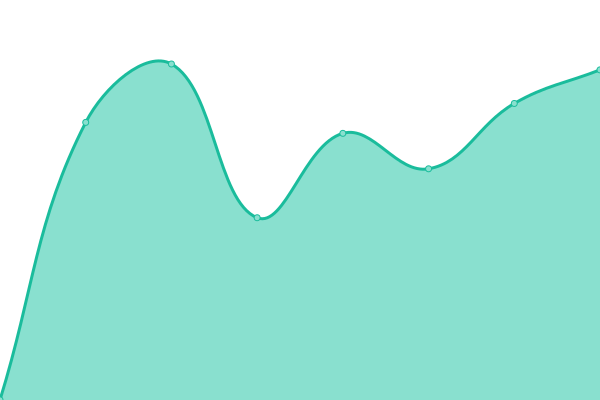
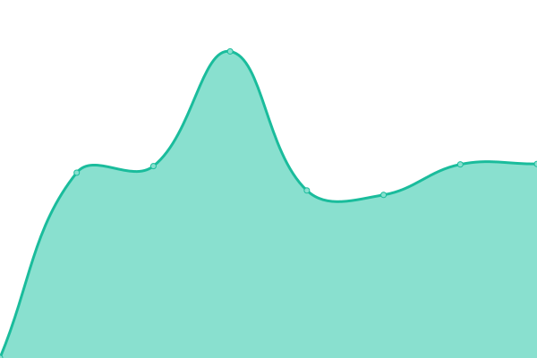
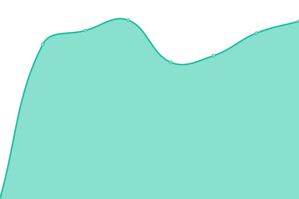

# [📈 Live Status](https://kalolina.github.io/uptime): <!--live status--> **🟩 All systems operational**

This repository contains the open-source uptime monitor and status page for [Upptime](https://upptime.js.org), powered by [Upptime](https://github.com/upptime/upptime).

With [Upptime](https://upptime.js.org), you can get your own unlimited and free uptime monitor and status page, powered entirely by a GitHub repository. We use [Issues](https://github.com/upptime/upptime/issues) as incident reports, [Actions](https://github.com/kalolina/uptime/actions) as uptime monitors, and [Pages](https://kalolina.github.io/uptime) for the status page.

<!--start: status pages-->
<!-- This summary is generated by Upptime (https://github.com/upptime/upptime) -->
<!-- Do not edit this manually, your changes will be overwritten -->
<!-- prettier-ignore -->
| URL | Status | History | Response Time | Uptime |
| --- | ------ | ------- | ------------- | ------ |
|  [Kalolina LLC](https://kalolina.com) | 🟩 Up | [kalolina-llc.yml](https://github.com/Kalolina/uptime/commits/HEAD/history/kalolina-llc.yml) | 

 1700ms
     
 | 

<a href="https://kalolina.github.io/uptime/history/kalolina-llc">100.00%</a>
    

|  [Kalolina Hub](https://hub.kalolina.com) | 🟩 Up | [kalolina-hub.yml](https://github.com/Kalolina/uptime/commits/HEAD/history/kalolina-hub.yml) | 

 1155ms
     
 | 

<a href="https://kalolina.github.io/uptime/history/kalolina-hub">100.00%</a>
    

|  [Kalolina Email](https://pro.kalolina.com) | 🟩 Up | [kalolina-email.yml](https://github.com/Kalolina/uptime/commits/HEAD/history/kalolina-email.yml) | 

 1621ms
     
 | 

<a href="https://kalolina.github.io/uptime/history/kalolina-email">99.70%</a>
    

|  [Kalolina SSO](https://sso.kalolina.com) | 🟩 Up | [kalolina-sso.yml](https://github.com/Kalolina/uptime/commits/HEAD/history/kalolina-sso.yml) | 

 725ms
     
 | 

<a href="https://kalolina.github.io/uptime/history/kalolina-sso">100.00%</a>
    

|  [Kalolina Status Page](https://status.kalolina.com) | 🟩 Up | [kalolina-status-page.yml](https://github.com/Kalolina/uptime/commits/HEAD/history/kalolina-status-page.yml) | 

 1151ms
     
 | 

<a href="https://kalolina.github.io/uptime/history/kalolina-status-page">99.71%</a>
    

<!--end: status pages-->

[**Visit our status website →**](https://kalolina.github.io/uptime)

## 📄 License

- Powered by: [Upptime](https://github.com/upptime/upptime)
- Code: [MIT](./LICENSE) © [Upptime](https://upptime.js.org)
- Data in the `./history` directory: [Open Database License](https://opendatacommons.org/licenses/odbl/1-0/)
